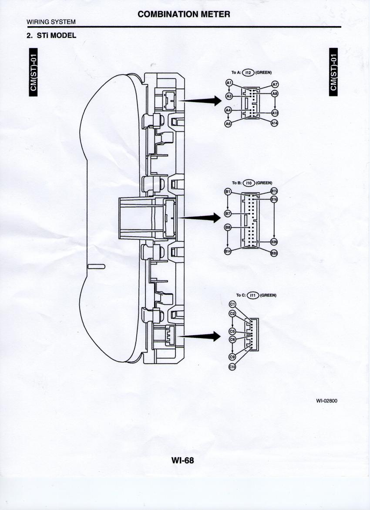
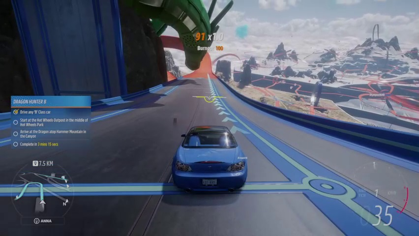
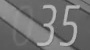
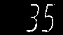
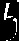

# RealSpeedometer

Table of contents: 
- [RealSpeedometer](#realspeedometer)
  * [1 - Summary of Project](#1---summary-of-project)
    + [1.1 - How it works (overview)](#11---how-it-works--overview-)
  * [2 - Demo Video](#2---demo-video)
  * [3 - Prerequisites](#3---prerequisites)
  * [4 - Setup](#4---setup)
    + [4.1 Gauge cluster](#41-gauge-cluster)
    + [4.2 Raspberry Pi 3B+](#42-raspberry-pi-3b-)
    + [4.3 Forza Horizon 5 (the racing game)](#43-forza-horizon-5--the-racing-game-)
  * [5 - Running the code](#5---running-the-code)
    + [5.1 Raspberry Pi 3B+ (RSEmbeddedDevice)](#51-raspberry-pi-3b---rsembeddeddevice-)
    + [5.2 Windows (RSWindows)](#52-windows--rswindows-)
  * [6 - Vision algorithm](#6---vision-algorithm)

## 1 - Summary of Project
This project aims to use a real gauge cluster from a car and making it work with racing video games.

The current code is a proof of concept that makes a Subaru Impreza (2002-2007) gauge cluster work with Forza Horizon 5 on PC. 

Do not hesitate to contact me on [LinkedIn](http://www.linkedin.com/in/banujan-atputharajah-556498222) if you want to discuss about this project.

### 1.1 - How it works (overview)
There are 2 parts of this project :
- A python program designed to run on a Windows platform where Forza Horizon 5 will be executed (In the folder "RSWindows"). This program will periodically take a screenshot of the game screen, detect the current speed and RPM using a custom made computer vision algorithm and send the data to the program running on the embedded device using a TCP connection (may change to USB in a future version of the project).

- An embedded device program that will run on a microcomputer such as a Raspberry Pi (In the folder "RSEmbeddedDevice"). The code will work with a Raspberry 3B+. Its responsibilty is to accept the data sent by the RSWindows program and update the actual gauge cluster.

## 2 - Demo Video
A demo video is available in the folder Doc/cluster_output_demo.mp4. 

As of writing this, I was only able to move the engine gauge temp. I will update the demo video as soon as I get the speedometer and the RPM gauge working. 

## 3 - Prerequisites
If you are looking to run this project you will need the following:
- A copy of Forza Horizon 5 on PC (you can get it through Steam store)
- A gauge cluster from a real car. You can acquire one at your local scrap yard. So far, the project only works with a Subaru Impreza 2002-2007 cluster.
- A Raspberry Pi (so far the project works only with a model 3B+)

## 4 - Setup
This setup will show you how you can run the program using a Raspberry Pi 3B+ and a Subaru Impreza 2002-2007 gauge cluster.

### 4.1 Gauge cluster
Here is the pinout of a 2002-2007 Subaru Impreza gauge cluster:

You need to connect the following pins:
| Pin  from cluster | Connect To  | Description of pin
|---|---| --- |
|A8 | Ground of supply | The ground signal of the engine temp gauge|
|A9 | Drain of N channel mosfet to be used on the Raspberry Pi | The PWM signal of the engine temp gauge|
|C6 | Ground of supply | Ground of the gauge cluster |
|C7 | +12V Supply | Ignition of the cluster |
|C10 | +12V Supply | Positive supply of the cluster

So far, I have not discovered which pin controls the speedometer and the RPM. This doc will be updated in a future release.

### 4.2 Raspberry Pi 3B+
1. Connect the Ground of the gauge cluster power supply to a ground pin of the Raspberry Pi. This will make sure the cluster and the Pi share the same ground.
2. Wire up an N-Channel mosfet. The gate to pin 12 (GPIO 18) of Raspberry PI 3B+ with. The drain to pin A9 of the gauge cluster and the source to ground. In my setup, I used a IRF540N but any N channel mosfet should do the job.

### 4.3 Forza Horizon 5 (the racing game)
For now, Forza Horizon 5 must be setup with an analog HUD speedometer in km/h (sorry americans!). Also, the game must be in full screen mode taking up the entire width of your screen.

## 5 - Running the code
### 5.1 Raspberry Pi 3B+ (RSEmbeddedDevice)
Build RSEmbeddedDevice on the Raspberry 3B+. CMake is required to build the project. 
Run the program (in the build directory that will be created) by indicating your desired TCP port for the connection. Example:

    sudo ./RSEmbeddedDevice 1234

### 5.2 Windows (RSWindows)
1. Before running the Windows code, you need to detect which monitor to record. The code uses indexes to identify your monitor. 

    If you only have 1 monitor and that is the monitor where Forza Horizon 5 will run, then your monitor index is 0. 

    If you have more than 1 monitor and need to identify them, run the python script monitorTest.py by passing the monitor index. It will show you a screenshot of the monitor you specified. Example:

        python monitorTest.py --monitor 1

    Change your monitor index to detect the screen where Forza Horizon 5 will run.

2. Run the code with the following argument. You need to know the IP address of the Raspberry Pi 3B+ (example 192.168.1.1), the port you opened (example: 1234) and your monitor index (example: 1)

        python main.py -ip 192.168.1.1 -p 1234 -monitor 1

If you setup everything correctly, you should see engine temp gauge moving as you accelerate. You can check out the demo video in the folder Doc/cluster_output_demo.mp4 for an expected output. 

## 6 - Vision algorithm
### 6.1 - Overview
This project uses a custom computer vision algorithm to detect the number displayed in the game's speedometer. What is particularly interesting about this algorithm is that it only runs on the CPU. This means you can let the game take full advantage of your GPU instead. 

Here's how it works. 
1. A screenshot is taken of the screen where the game is running. Example:
    

2. Apply a grayscale to the screenshot
3. We defined an area of interest on the screen to crop. This is where the speedometer of the game will be located.

    

4. Threshold the image to get the digits representing the speed:

    

5. Use OpenCV's contour detection function to seperate each digit. In this example, only 2 digits are detected (3 and 5). The order of the numbers are remembered by the pixel x position that OpenCV returns (this is for the prediction phase).

    

    

6. When in training mode, we label these 2 digits as 3 and 5 respectively. Then, we save them in a file. This will be our labeled dataset.

7. During the prediction phase we repeat step 1 to 5 but we substract each digit with each entry in the dataset. We know we have a match if the resulting image is completly (or almost) black. Otherwise it is an incorrect match. For example, look what happens when we substract the digit 3 and 5 shown in step 5:

    

    I noticed the game does not draw the digits at the same location every time. There's small difference of a few pixels. To fix this, I applied a small erosion filter to the substracted image. This guarantees us a match with the digit saved in the dataset. 

8. By remembering the position of the digits (step 5), we can reconstruct the number. For example, we detected the digit 3 at position x = 38 pixel and we detected digit 5 at position x = 60. So, we know 3 comes before 5 and we get 35 as the prediction.

And there you have it! Quite a simple algorithm but is very effective as we don't need a complex neural network to do a similar job. The fact that it runs on the CPU only is a huge plus as the GPU might be overwhelmed by running the game. There are some pros and cons to this algorithm:

Pros:
- Runs on CPU
- Easy to train
- Fast to predict (around 3 - 5 ms average on my Intel 11700 CPU)

Cons:
- Since every game uses a different font, we need to train a separate dataset for a specific game. 
- The speedometer location will vary from game to game. Again, a need to develop a specific dataset for a game.

### 6.2 Training
I will post instructions on how to train and detect number for your game in a future version of this doc.